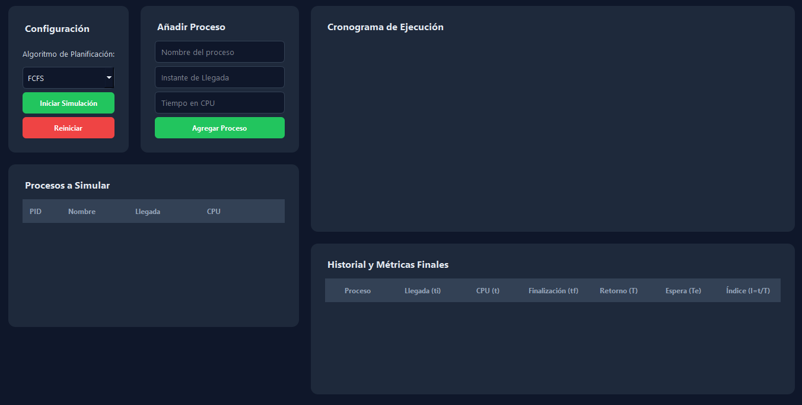
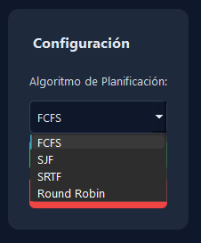
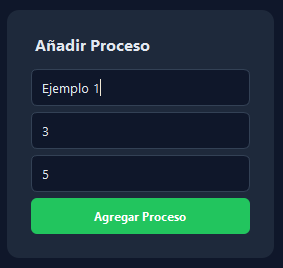
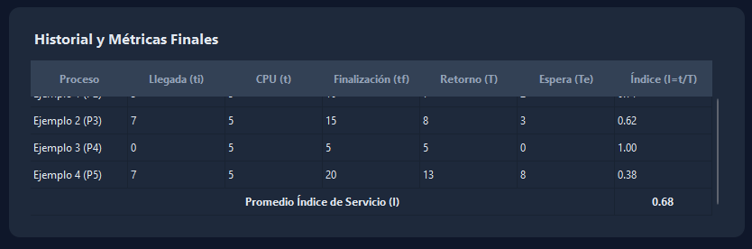

# Simulador de Planificación de Procesos — Manual técnico

**Proyecto:** PR2-SO — Segundo Proyecto de Sistemas Operativos (Grupo #7, Sección B)

---
## 📌 Introducción

El presente proyecto implementa un **simulador gráfico de algoritmos de planificación de procesos**.  
Su función es modelar el comportamiento de la CPU al ejecutar procesos bajo distintos esquemas, tales como **First Come First Served (FCFS), Shortest Job First (SJF), Round Robin y Prioridades**.  

A través de la aplicación, el usuario puede ingresar procesos, ejecutar los algoritmos y obtener **resultados numéricos y visuales** que incluyen métricas de rendimiento y un **diagrama de Gantt** que muestra la secuencia de ejecución.  
De esta manera, el programa facilita el **análisis comparativo y el aprendizaje** de las técnicas de planificación utilizadas en sistemas operativos.

# Requisitos técnicos

**Lenguaje usado:**
Python 3.10 o superior (probado también en Python 3.11, 3.12 y 3.13).

**Entorno de Desarrollo:**
Cualquier IDE o editor compatible con Python. Recomendado: **PyCharm**, **Visual Studio Code** o directamente ejecución con terminal. La GUI utiliza PySide6, por lo que es recomendable un entorno con soporte gráfico.

**Python Development Kit:**
Se requiere tener instalado Python y `pip` para gestionar dependencias.

**Bibliotecas utilizadas:**

* **PySide6**: Base para la construcción de la GUI con Qt (QMainWindow, QWidget, QTableWidget, QDialog, QPushButton, QVBoxLayout, etc.).
* **shiboken6**: Dependencia necesaria para PySide6.
* **collections (deque)**: Uso en la simulación de colas de procesos.
* **copy (deepcopy)**: Para clonar procesos al inicio de la simulación.
* **sys**: Usado en `main.py` para inicializar la aplicación Qt.

**Clases personalizadas (módulos del proyecto):**

* `core.Proceso`: Modelo que representa a un proceso (PID, nombre, llegada, ráfaga de CPU).
* `core.Planificador`: Implementa los algoritmos de planificación (FCFS, SJF, SRTF, Round Robin).
* `gui.CustomErrorDialog`: Cuadro de diálogo para mostrar errores.
* `gui.EditProcessDialog`: Diálogo para editar un proceso.
* `gui.MainWindow`: Ventana principal que controla el flujo de la aplicación (agregar procesos, seleccionar algoritmo, ejecutar simulación, mostrar cronograma y estadísticas).

**Estructura de carpetas:**

```
PR2-SO/
├─ Codigos/
│  ├─ core.py        # Lógica central (Proceso, Planificador)
│  ├─ gui.py         # Interfaz gráfica (MainWindow, diálogos)
│  └─ main.py        # Punto de entrada a la aplicación
├─ requirements.txt  # Dependencias del proyecto
```

**Sistema Operativo:**
Multiplataforma: Windows, Linux o macOS (requiere entorno gráfico para abrir la GUI).

**Recursos externos:**
Ninguno. Todo se maneja dentro del programa. El usuario interactúa con la interfaz gráfica para ingresar procesos y configurar el algoritmo.

---

# Explicación de cada archivo y sus funciones

## `core.py`

Este archivo contiene la lógica principal del simulador.

### Clase `Proceso`

* Representa un proceso del sistema.
* Atributos: `pid`, `nombre`, `tiempo_cpu_total`, `instante_llegada`, `tiempo_restante_cpu`.
* Función: sirve como modelo de datos, no contiene lógica compleja.

### Clase `Planificador`

* Encargada de ejecutar la simulación según el algoritmo seleccionado.
* Constructor recibe: lista de procesos, algoritmo (`FCFS`, `SJF`, `SRTF`, `Round Robin`) y quantum (si aplica).
* Método `ejecutar_simulacion()`: genera el cronograma, duración total y estadísticas por proceso.
* Implementa:

  * **FCFS:** First-Come, First-Served, no expropiativo.
  * **SJF:** Shortest Job First, no expropiativo.
  * **SRTF:** Shortest Remaining Time First, expropiativo.
  * **Round Robin:** Expropiativo, con quantum configurable.
* Calcula estadísticas: `ti` (llegada), `t` (CPU total), `tf` (finalización), `T` (turnaround), `Te` (espera), `I` (uso relativo de CPU).

---

## `gui.py`

Este archivo define la interfaz gráfica de la aplicación usando PySide6.

### Clase `CustomErrorDialog`

* Ventana emergente para mostrar mensajes de error.

### Clase `EditProcessDialog`

* Permite modificar los datos de un proceso ya agregado.
* Devuelve los datos editados en formato diccionario.

### Clase `MainWindow`

* Ventana principal de la aplicación.
* Paneles:

  * **Configuración:** elegir algoritmo y quantum.
  * **Agregar proceso:** formulario para introducir procesos.
  * **Procesos agregados:** tabla con los procesos, permite editar/eliminar.
  * **Cronograma:** tabla donde se muestra la ejecución por instantes.
  * **Estadísticas:** tabla con métricas de cada proceso.
* Métodos clave:

  * `agregar_proceso_a_lista()`: añade un proceso nuevo.
  * `iniciar_simulacion_ui()`: ejecuta la simulación con el planificador.
  * `mostrar_cronograma()`: pinta en la tabla los estados por instante.
  * `mostrar_estadisticas()`: muestra métricas finales.
  * `reiniciar_simulacion_ui()`: limpia todos los datos para empezar de nuevo.

---

## `main.py`

Archivo de inicio de la aplicación.

* Importa `QApplication` y `MainWindow`.
* Crea la instancia de la app y abre la ventana principal.
* Permite ejecutar la aplicación con:

```bash
python Codigos/main.py
```

Interfaz del Simulador de Procesos

La aplicación cuenta con una interfaz gráfica intuitiva que permite al usuario configurar y observar la ejecución de procesos bajo distintos algoritmos de planificación (FCFS, SJF, SRTF y Round Robin).



Selección del Algoritmo
En este paso, el usuario elige uno de los algoritmos de planificación disponibles, como se especifica en la documentación. Las opciones incluyen:

FCFS (Primero en llegar, primero en ser atendido)
SJF (El trabajo más corto primero)
SRTF (Tiempo restante más corto primero)
Round Robin (Partido redondo)



Creación de un Proceso
En el panel "Añadir Proceso", el usuario ingresa los datos de un nuevo proceso para la simulación. En la imagen, se está creando un proceso con las siguientes características:

Nombre del proceso: "Ejemplo 1"
Instante de Llegada: "3" (unidades de tiempo)
Tiempo en CPU: "5" (unidades de tiempo)



Visualización de Procesos a Simular
Una vez creados, los procesos se listan en el panel "Procesos a Simular". Aquí se pueden ver sus atributos clave:

PID: El identificador único del proceso, que se genera automáticamente.
Nombre: El nombre asignado por el usuario.
Llegada: El instante en que el proceso llega al sistema.
CPU: El tiempo total de CPU que necesita.
Esta tabla permite al usuario revisar y gestionar los procesos antes de iniciar la simulación.


Cronograma de Ejecución
Esta imagen muestra el "Cronograma de Ejecución" o diagrama de Gantt. Después de que se ha iniciado la simulación, este panel muestra cómo la CPU ejecuta cada proceso a lo largo del tiempo, de acuerdo con el algoritmo de planificación seleccionado. Cada fila representa un proceso (como "Ejemplo 1 (P3)"), y las celdas de colores indican el tiempo que la CPU le dedica a cada uno. La "X" podría representar tiempo de espera o inactividad de la CPU. En este caso, el cronograma corresponde al algoritmo FCFS.


Historial y Métricas Finales
Una vez que la simulación ha avanzado, el panel "Historial y Métricas Finales" se llena con los resultados de los procesos que han terminado. Esta tabla proporciona datos cruciales para analizar la eficiencia del algoritmo, incluyendo:

Llegada (ti): Instante en que el proceso llegó.
CPU (t): Tiempo total que necesitó en la CPU.
Finalización (tf): Instante en que el proceso terminó.
Retorno (T): El tiempo que el proceso pasó en el sistema (desde que llegó hasta que terminó).
Espera (Te): El tiempo total que el proceso esperó en la cola antes de ser ejecutado.
Índice (I=t/T): Una métrica de rendimiento que relaciona el tiempo de CPU con el tiempo de retorno.


